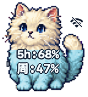
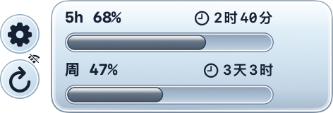

# 额度水滴 Dev

本地 Codex 额度桌宠与 Codex 插件，macOS 14+。仓库标识为 `quota-companion`，显示名和 Bundle ID `dev.quota-companion.mac` 保持不变。MIT 许可；独立项目，非 OpenAI 官方产品。

当前源码版本 **0.1.12，build 15**：以现有 Mac 版 build 14 为基础整理公开发布，保留桌宠、设置与角色导入功能，修正插件版本及发布流程，并增加隔离验证模式。未包含手机端改动。本地 ad-hoc 包仅用于测试，未经 Developer ID 签名或 Apple 公证；不能保证在下载后的普通 Mac 上直接打开。




以上为本机原生视图渲染，68% / 47% 为合成示例，离线符号也属于示例状态，不是真实账户额度。

## 功能

- 桌面猫咪显示主 Codex 桶的剩余额度；仅显示服务器实际返回的窗口。悬停展开，移出收起，支持拖动、边缘吸附和尺寸设置。
- 菜单栏入口、刷新、重置倒计时、中英文、低额度提醒、可选语音和减少动态效果。
- 自定义颜色、本地背景裁剪、v1/v2 分层角色包；首次启动默认使用内置猫咪。
- 离线保留上次快照并标为缓存；恢复后重新读取。支持逐显示器位置和设置保存。
- 四个 MCP 工具：`get_quota_status`、`show_companion`、`collapse_companion`、`open_companion_settings`。

## 安装与使用

每位用户必须在自己的 Mac 上安装 Codex，并用自己的 ChatGPT 账户登录；本项目不提供或共享登录凭据。额度由官方 App Server 提供，账号或 CLI 不支持该接口时会显示不可用。见 [安装和手动升级](docs/INSTALL.md)。

源码构建需要 Xcode / Swift 6、Python 3 和 Git，无第三方 Swift 包依赖：

```sh
./scripts/validate.sh
./scripts/package-app.sh debug
```

测试包含原生窗口和 HEIC 编解码，需要已登录的 macOS 图形会话。打包脚本输出 `dist/额度水滴 Dev.app`，不会自动安装、启动或替换运行版。正式双架构测试包使用 [发布流程](docs/RELEASE.md)，要求干净 Git 提交。

## 插件

推荐安装随 Mac app 打包的本地插件市场：设置 → 连接与高级 → 安装 Codex 插件，检查命令并确认添加市场，再在 Codex 插件目录安装「额度水滴 Dev」。安装后开启新会话。源码树不提交已编译 helper；不要直接把未构建的源码市场当作可运行插件。见 [插件说明](docs/PLUGIN.md)。

## 数据、限制与反馈

应用保存自己的设置、处理后的本地素材和不含账户身份的额度快照。应用没有遥测或上传服务；它启动的官方 Codex CLI 会按自身机制连接 OpenAI、使用本机登录。插件调用的额度结果会返回当前 Codex 会话。详见 [隐私说明](docs/PRIVACY.md)、[安全反馈](SECURITY.md)、[排错与限制](docs/TROUBLESHOOTING.md) 和 [角色包格式](docs/CHARACTER-PACKAGE.md)。

本轮只支持 [GitHub Releases](https://github.com/TianT-hus/quota-companion/releases) 手动更新，没有自动更新器。公开目标及内置素材分发权已确认；当前发行包为 ad-hoc 测试包，Developer ID、公证、Intel 真机和下载首启尚未验收。素材说明见 [第三方与素材记录](THIRD_PARTY_NOTICES.md)。
